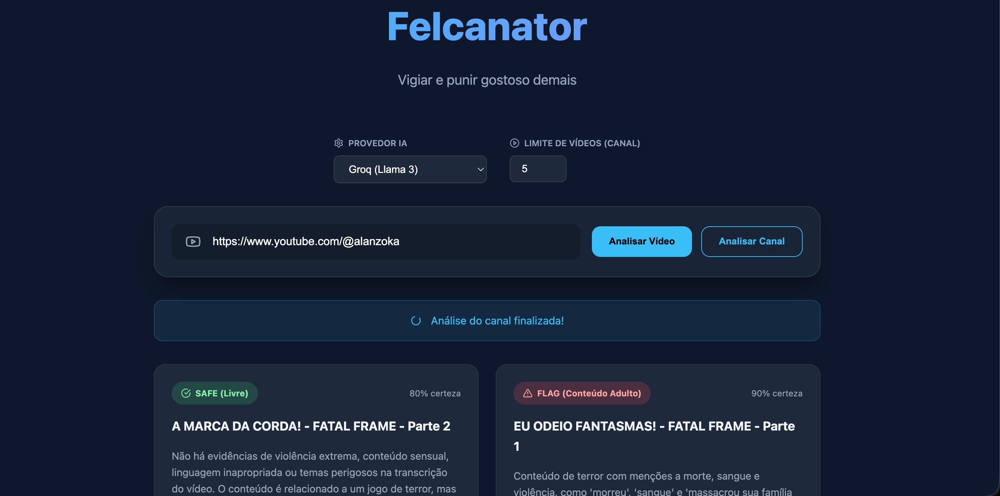
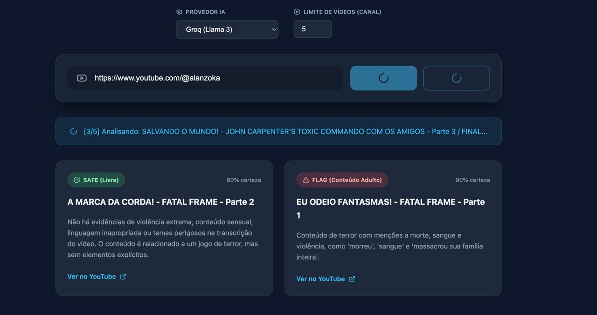

# 🕵️ Felcanator: Vigilância Inteligente de Conteúdo

> *"Vigiar e punir gostoso demais"*

[](https://reactjs.org/)
[](https://fastapi.tiangolo.com/)
[](https://www.python.org/)
[](#)

[English](#english) | [Português](#português)

---

<a name="english"></a>
## 🇬🇧 English Version

**Felcanator** is a modern, AI-powered tool designed to identify and flag inappropriate YouTube content for children (adhering to strict child safety guidelines). It analyzes video metadata, deep transcripts, and auto-restricts verified 18+ content in real-time, providing high-confidence safety classifications.

### 📸 Screenshots
<p align="center">
  
  
</p>

### ✨ Key Features
- **🤖 Multi-LLM Support**: Choose between Google Gemini 2.0 Flash (Default), OpenAI (GPT-4o mini), Anthropic (Claude 3 Haiku), Groq (Llama 3), LM-Studio (local), or Ollama (local).
- **⚡ Real-Time Channel Processing**: Watch results appear one-by-one instantly as the AI analyzes entire channel playlists using Server-Sent Events (SSE).
- **🔞 Smart Age-Restriction Bypass**: Automatically detects YouTube's native age-restricted videos and instantly flags them without wasting API tokens.
- **📝 Deep Transcript Auditing**: Downloads and processes actual video transcripts to catch hidden profanity, violence, and suggestive themes.

### 🧩 Prerequisites (For Beginners)
Before running the app, ensure you have installed on your computer:
1. **[Node.js](https://nodejs.org/)** (v18 or newer)
2. **[Python](https://www.python.org/downloads/)** (v3.10 or newer)
3. **An AI API Key**: Get a free API key from [Groq](https://console.groq.com/keys) (Super Fast) or [Google AI Studio](https://aistudio.google.com/) (Gemini 2.0).

### 🛠️ Configuration
1. Open the `backend/` folder on your computer.
2. Find the file named `.env.example`.
3. Rename it to exactly `.env` (remove the `.example` part).
4. Open this new `.env` file in Notepad (Windows) or TextEdit (Mac) and paste your API key/endpoint configuration next to the provider you chose. For `lmstudio` and `ollama`, set `LMSTUDIO_BASE_URL`/`OLLAMA_BASE_URL` and `LMSTUDIO_MODEL`/`OLLAMA_MODEL` (API key may be optional depending on your local setup). Save and close.

### 🚀 How to Run (Simple & Fool-Proof)
1. Open your **Terminal** (Mac/Linux) or **Command Prompt/PowerShell** (Windows).
2. Navigate to this project's folder.
3. Type the following magical command and press Enter:
```bash
npm run setup && npm start
```
*Wait a few seconds. This command automatically builds the Python virtual environment and opens the web application in your browser!*

---

<a name="português"></a>
## 🇧🇷 Versão em Português

**Felcanator** é o auditor implacável de conteúdo infantil. Uma ferramenta baseada em Inteligência Artificial criada para varrer, analisar e sinalizar vídeos inadequados no YouTube. Ele cruza metadados, transcrições completas de áudio e restrições nativas da plataforma em tempo real.

### 📸 Telas / Screenshots
<p align="center">
  
  
</p>

### ✨ Principais Funcionalidades
- **🤖 Múltiplos Motores de IA**: Controle o cérebro da operação escolhendo entre Google Gemini 2.0 Flash, OpenAI (GPT-4o mini), Anthropic (Claude 3) ou Groq (Llama 3), LM-Studio (local) ou Ollama (local).
- **⚡ Análise de Canais em Tempo Real**: Cole o link de um canal e assista aos *cards* de resultados pularem na tela um a um via SSE (Streaming), sem travar o navegador.
- **🔞 Auto-Flag de Restrição de Idade**: O backend detecta imediatamente se o YouTube marcou o vídeo como +18 e aplica a punição ("FLAG") instantaneamente, economizando tempo e tokens da IA.
- **📝 Auditoria Profunda de Transcrição**: Não julga o livro pela capa. O sistema baixa a legenda do vídeo para caçar palavrões ocultos, apologia à violência ou temas complexos, contornando o limite de tamanho (truncamento inteligente).

### 🧩 Pré-requisitos (Para Iniciantes)
Antes de rodar o programa, você precisa ter instalado no seu computador:
1. **[Node.js](https://nodejs.org/)** (versão 18 ou superior)
2. **[Python](https://www.python.org/downloads/)** (versão 3.10 ou superior)
3. **Uma Chave de IA (API Key)**: Crie uma conta gratuita no [Groq](https://console.groq.com/keys) (para o Llama 3 super rápido) ou no [Google AI Studio](https://aistudio.google.com/) (para o Gemini 2.0).

### 🛠️ Configuração Inicial
1. Abra a pasta `backend/` no seu computador.
2. Encontre o arquivo chamado `.env.example`.
3. Renomeie esse arquivo para exatamente `.env` (apague a parte final `.example`).
4. Abra esse novo arquivo `.env` no Bloco de Notas (Windows) ou Editor de Texto (Mac) e cole a chave de API/endpoint no campo correto. Para `lmstudio` e `ollama`, configure `LMSTUDIO_BASE_URL`/`OLLAMA_BASE_URL` e `LMSTUDIO_MODEL`/`OLLAMA_MODEL` (a API key pode ser opcional dependendo do seu setup local). Salve e feche.

### 🚀 Como Rodar (À Prova de Falhas)
1. Abra o seu **Terminal** (Mac/Linux) ou **Prompt de Comando / PowerShell** (Windows).
2. Navegue até a pasta deste projeto.
3. Digite a combinação mágica abaixo e aperte Enter:
```bash
npm run setup && npm start
```
*Aguarde alguns segundinhos. Esse comando instala a internet inteira silenciosamente e o seu navegador vai abrir o Felcanator na mesma hora!*

---

## 📁 Estrutura do Projeto / Project Structure
- `/backend`: Motor em FastAPI Python. Integrado com `yt-dlp`, SDK `google-genai` e `sse-starlette` para streaming.
- `/frontend`: Interface React + Vite fluida e moderna, turbinada com animações `framer-motion` e ícones `lucide-react`.

## ⚖️ Contexto Legal / Legal Context
Criado para auxiliar na curadoria rigorosa e adesão civil às diretrizes de segurança e proteção infantil. / Created to assist in strict curation and adherence to child safety regulations.
